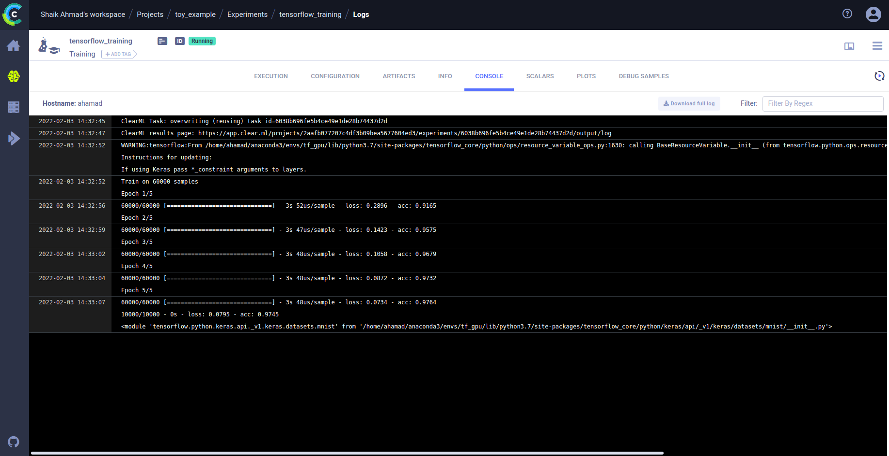

# Clearml-tutorails - 1
  In this tutorial, I will show you how to start uisng the clearml, initializing the clearml with an open server, tracking the progress using a simple mnist example.

## Step-1 - Installing the ClearML
  If you have an environment with tensorflow already installed init, then you can install the clearml using pip. Or else you can find necessary packages inside the requirements.txt.

  ```
  $ pip install cleaml
  ```
## Step-2 - Initialization of cleaml with server
  The next step to perform after installing the clearml is initializing with the server using `clearml-init`. In this example we are using an open server. As per the documantion We can also create and host our own server locally. This one we cover in the future tutorials

  ```
  $ clearml-init
  ```
  This shows a response like below and asks you to enter the credentials for workspace configuration.

  ```
  ClearML SDK setup process

  Please create new clearml credentials through the profile page in your `clearml-server` web app (e.g. http://localhost:8080/profile)
  Or create a free account at https://app.community.clear.ml/profile

  In the profile page, press "Create new credentials", then press "Copy to clipboard".
  ```  
  The actual place where it shows the credentials is `https://app.clear.ml/settings/workspace-configuration`. If you haven't created any account in the server, you need to create a free account in the server. There you can see an option to *Create new credentials*.
    

  pasting that and accepting the api addresses will complete the initialization work.

  ```
  Paste copied configuration here: We get this copy from the above link.
  api {
      # Shaik Ahmad's workspace
      web_server: https://app.clear.ml
      api_server: https://api.clear.ml
      files_server: https://files.clear.ml
      credentials {
          "access_key" = "QVY5AYRUY44AYHB0NHYM"
          "secret_key" = "qef14khBo1hvR6LsqPjRqZXlQfJZi4BzXTy5lUnyehT9dD4Q34"
      }
  }
  Detected credentials key="QVY5AYRUY44AYHB0NHYM" secret="qef1***"
  WEB Host configured to: [https://app.clear.ml]
  API Host configured to: [https://api.clear.ml]
  File Store Host configured to: [https://files.clear.ml]

  ClearML Hosts configuration:
  Web App: https://app.clear.ml
  API: https://api.clear.ml
  File Store: https://files.clear.ml

  Verifying credentials ...
  Credentials verified!

  New configuration stored in /root/clearml.conf
  ClearML setup completed successfully.    
  ```
  In this web_server URL, api_server URL and files_server URLS by default assigned to clearML open server. If we run the server locally that address will change to localhost. Or if you run it on aws instance we might need to specify the URLs.

## Step-3 Executing the Script Locally
  Now we run the toy_example.py script. This script develops classifier for mnist data. In the file most of the code looks almost the same for any tensorflow based model development pipeline except two lines which are.

  ```
  from clearml import Task
  task = Task.init(project_name='toy_example',
                  task_name='tensorflow_training')

  ```  
  Here we make use of the Task functionality from clearML. By initilizing the task with necessary project details, when we run the script, it automatically starts loging the necessary information and also starts pushing the logs to the server.
  In the log itself we get a link related to clearml server from where we can see the project status.

  The log would look something like this.

  ```
  ClearML Task: overwriting (reusing) task id=6038b696fe5b4ce49e1de28b74437d2d
  ClearML results page: https://app.clear.ml/projects/c4df3b09bea5672aafb077207/experiments/b7446038b696fe537d2db4ce49e1de28/output/log
/service.cc:176]   StreamExecutor device (0): GeForce GTX 1660 Ti, Compute Capability 7.5
  Epoch 1/5
  2022-02-03 14:32:53.361582: I tensorflow/stream_executor/platform/default/dso_loader.cc:44] Successfully opened dynamic library libcublas.so.10.0
  60000/60000 [==============================] - 3s 52us/sample - loss: 0.2896 - acc: 0.9165
  Epoch 2/5
  60000/60000 [==============================] - 3s 47us/sample - loss: 0.1423 - acc: 0.9575
  Epoch 3/5
  60000/60000 [==============================] - 3s 48us/sample - loss: 0.1058 - acc: 0.9679
  Epoch 4/5
  60000/60000 [==============================] - 3s 48us/sample - loss: 0.0872 - acc: 0.9732
  Epoch 5/5
  60000/60000 [==============================] - 3s 48us/sample - loss: 0.0734 - acc: 0.9764
  10000/10000 - 0s - loss: 0.0795 - acc: 0.9745
  ```
## Step-4 Validating the Execution on the Server.
  By opening the server, you can see the details related to the current execution along with necessary logging.
    

  In the top we can see some more information using which we can see the related data. 
